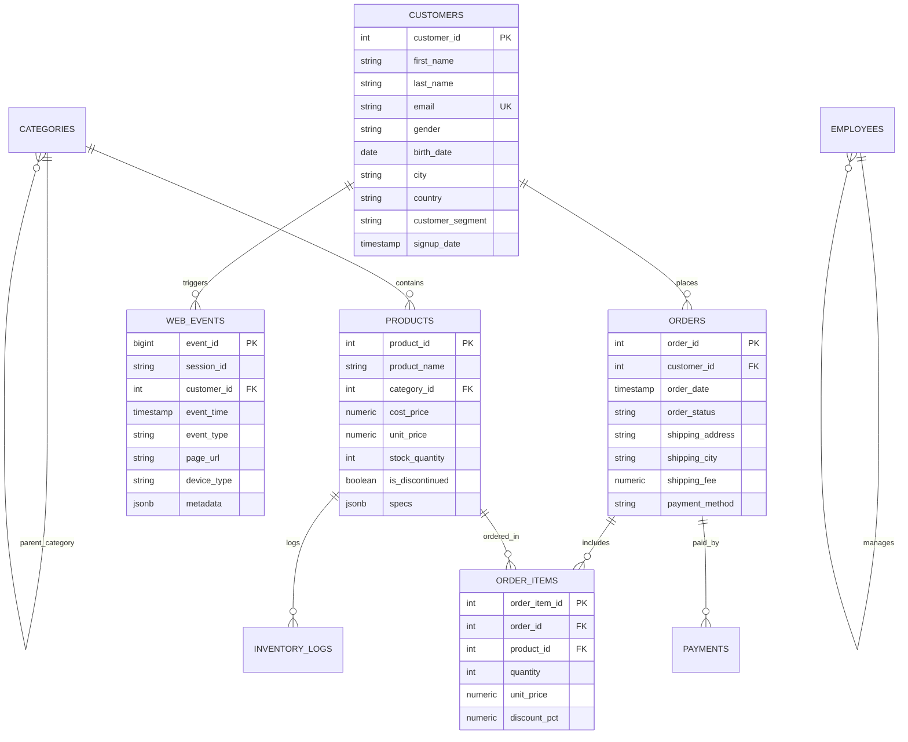

# 🚀 SQL MASTERY: FROM DATA ANALYST (DA) TO DATA ENGINEER (DE)

Chào mừng bạn đến với bộ tài liệu và cẩm nang thực hành **SQL Toàn Diện & Chuyên Sâu** dành cho cả 2 định hướng nghề nghiệp: **Data Analyst (Phân tích dữ liệu)** và **Data Engineer (Kỹ thuật dữ liệu)**.

Tài liệu được thiết kế theo tiêu chuẩn thực chiến công nghiệp (Industry Best Practices), kết hợp giữa **lý thuyết chiều sâu**, **mã lệnh SQL tối ưu**, **hệ thống bài tập thực hành & lời giải**, **bài toán kinh doanh thực tế (Business Case Studies)** và **câu hỏi phỏng vấn chuẩn FAANG / Tech Giants**.

> **Bạn chưa biết lập trình vẫn có thể bắt đầu từ đây.** Đọc trước [00_huong_dan_nguoi_moi.md](00_huong_dan_nguoi_moi.md): tài liệu giải thích bảng/dòng/cột, cách database đọc một câu SQL, từ khoá nào cần nhớ và cách chạy từng ví dụ an toàn. Trong mỗi bài, hãy ưu tiên các ghi chú `💬 ĐỌC DÒNG NÀY`, `💡 TẠI SAO`, `📌 DÙNG KHI NÀO`, `⭐ MỨC ĐỘ DÙNG`, `🧠 CẦN NHỚ` và `⚠️ CẠM BẪY`.

---

## 📑 MỤC LỤC & LỘ TRÌNH HỌC TẬP

```text
sql-mastery-da-de/
├── init_database.sql                            # [BẮT BUỘC] Script khởi tạo CSDL E-commerce mẫu & Seed Data
│
├── 01_foundation_querying/                      # 📌 Giai đoạn 1: Nền tảng truy vấn & Kiểu dữ liệu
│   ├── 01_select_from.sql                       # SELECT, Alias, Biểu thức số học, DISTINCT, DISTINCT ON
│   ├── 02_where_filtering.sql                   # Toán tử logic, IN/BETWEEN, LIKE/ILIKE/Regex, 3-Valued Logic & NULL
│   ├── 03_order_limit.sql                       # Sắp xếp đa tầng, NULLS FIRST/LAST, Pagination & Keyset Cursor
│   ├── 04_data_types_type_casting.sql           # Kiểu số, chuỗi, thời gian (Timestamp/TZ), Ép kiểu (CAST / ::)
│   └── 05_practice_exercises.sql                # ✍️ BÀI TẬP THỰC HÀNH & LỜI GIẢI MODULE 01 (10 bài tập)
│
├── 02_aggregation_grouping/                     # 📌 Giai đoạn 2: Gom nhóm & Tính toán Tổng hợp
│   ├── 01_aggregate_functions.sql               # COUNT, SUM, AVG, MIN, MAX, STRING_AGG, PERCENTILE (Stats)
│   ├── 02_group_by_having.sql                   # GROUP BY, HAVING vs WHERE, GROUPING SETS, ROLLUP, CUBE (OLAP)
│   ├── 03_case_when_coalesce.sql                # CASE WHEN, FILTER (WHERE ...), COALESCE, NULLIF, GREATEST/LEAST
│   ├── 04_date_time_aggregations.sql            # DATE_TRUNC, EXTRACT, Time Bucketing, Rolling Metrics, Timezone
│   └── 05_practice_exercises.sql                # ✍️ BÀI TẬP THỰC HÀNH & LỜI GIẢI MODULE 02 (10 bài tập)
│
├── 03_table_joins/                              # 📌 Giai đoạn 3: Kết hợp bảng & Quan hệ dữ liệu
│   ├── 01_inner_left_right.sql                  # INNER, LEFT, RIGHT JOIN, Cơ chế lọc ON vs WHERE, Multi-table JOIN
│   ├── 02_full_cross_self_anti.sql              # FULL OUTER, CROSS (Tạo lịch), SELF JOIN, Semi-Join (EXISTS), Anti-Join
│   ├── 03_set_operations.sql                    # UNION vs UNION ALL (Hiệu năng), INTERSECT, EXCEPT
│   ├── 04_advanced_join_patterns.sql            # Non-Equi Joins (Khoảng giá, ngày), CROSS/LEFT JOIN LATERAL
│   └── 05_practice_exercises.sql                # ✍️ BÀI TẬP THỰC HÀNH & LỜI GIẢI MODULE 03 (10 bài tập)
│
├── 04_advanced_analytics_da/                    # 🎯 Giai đoạn 4: Phân tích Dữ liệu Nâng cao (Dành riêng cho DA)
│   ├── 01_subqueries_cte.sql                    # Scalar/Correlated Subqueries, CTEs, WITH RECURSIVE (Cây phân cấp)
│   ├── 02_window_functions_ranking.sql          # ROW_NUMBER, RANK, DENSE_RANK, NTILE, Top-N per Group
│   ├── 03_window_functions_time_series.sql      # LAG, LEAD, Running Total, 7d/30d Moving Average, Frame Clause
│   ├── 04_cohort_retention_funnel.sql           # Ma trận Cohort Retention (Tháng 0-N), User Churn, Sales Funnel, LTV
│   ├── 05_pivot_unpivot_matrix.sql              # Xoay dòng thành cột (Pivot/Crosstab), Xoay cột thành dòng (Unpivot)
│   ├── 06_rfm_customer_segmentation.sql         # Phân khúc khách hàng RFM (Recency, Frequency, Monetary)
│   └── 07_practice_exercises.sql                # ✍️ BÀI TẬP THỰC HÀNH & LỜI GIẢI MODULE 04 (10 bài tập)
│
├── 05_engineering_systems_de/                   # ⚙️ Giai đoạn 5: Kỹ thuật Hệ thống & Tối ưu CSDL (Dành riêng cho DE)
│   ├── 01_ddl_constraints.sql                   # DDL, Ràng buộc toàn vẹn (PK, FK, CHECK, UNIQUE), Generated Columns
│   ├── 02_transactions_upsert.sql               # ACID, Isolation Levels, Row Locking (FOR UPDATE SKIP LOCKED), UPSERT, MERGE
│   ├── 03_data_modeling_scd.sql                 # Star/Snowflake Schema, Fact/Dim tables, SCD Type 1, Type 2, Type 3, Type 4
│   ├── 04_performance_tuning.sql                # EXPLAIN ANALYZE, B-Tree, GIN, BRIN, Partial/Covering Index, Anti-patterns
│   ├── 05_partitioning_maintenance.sql          # Range/List/Hash Partitioning, VACUUM, REINDEX, Materialized Views
│   ├── 06_json_semistructured_data.sql          # JSON vs JSONB, Trích xuất (->, ->>, #>), Indexing GIN trên JSONB
│   └── 07_practice_exercises.sql                # ✍️ BÀI TẬP THỰC HÀNH & LỜI GIẢI MODULE 05 (10 bài tập)
│
├── 06_real_world_projects_and_interview_prep/   # 🏆 Giai đoạn 6: Dự án Thực tế & Luyện phỏng vấn FAANG
│   ├── 01_ecommerce_da_case_study.sql           # Case Study DA: 10 bài toán phân tích kinh doanh chiến lược
│   ├── 02_data_pipeline_de_project.sql          # Case Study DE: Pipeline ETL/ELT từ Staging -> Quality -> SCD2 DWH
│   └── 03_faang_interview_sql_questions.sql     # Tuyển tập câu hỏi SQL phỏng vấn FAANG (LeetCode Medium/Hard)
│
└── 07_capstone_exercises_and_solutions/         # 🎓 Giai đoạn 7: Đề thi thử Capstone Mock Exams
    ├── 01_da_analytics_exam.sql                 # Đề thi thực chiến Data Analyst (Business Insights & Metrics)
    └── 02_de_pipeline_exam.sql                  # Đề thi thực chiến Data Engineer (Data Quality, SCD2 & Index Tuning)
```

---

## 🗄️ SƠ ĐỒ THỰC THỂ CƠ SỞ DỮ LIỆU (ERD)

Database mẫu mô phỏng hệ thống **E-commerce & Web Analytics** hiện đại:



---

## 🛠️ HƯỚNG DẪN THỰC THI (QUICK START)

### Cách 1: Sử dụng DBeaver / pgAdmin / DataGrip / VS Code (Khuyên dùng)
1. Mở công cụ quản trị CSDL của bạn (kết nối tới PostgreSQL hoặc DuckDB).
2. Chạy toàn bộ file [`init_database.sql`](init_database.sql).
3. Mở bất kỳ file bài học nào từ folder `01_` đến `07_` và chạy từng block lệnh để học và đối chiếu kết quả.

### Cách 2: Sử dụng Command Line (psql)
```bash
# Khởi tạo database
psql -U postgres -d your_database -f init_database.sql

# Thực thi một bài học cụ thể
psql -U postgres -d your_database -f 04_advanced_analytics_da/04_cohort_retention_funnel.sql
```

---

## 🎯 SO SÁNH TRỌNG TÂM KIẾN THỨC: DA vs DE

| Tiêu chí | Data Analyst (DA) | Data Engineer (DE) |
| :--- | :--- | :--- |
| **Mục tiêu cốt lõi** | Trích xuất insight, đo lường KPI, tối ưu chuyển đổi kinh doanh | Thiết kế hệ thống, tối ưu hiệu năng lưu trữ/truy vấn, pipeline ETL/ELT |
| **SQL Nâng cao** | Window functions, Cohort, Funnel, RFM, Dynamic Pivot, Statistical Aggregates | Idempotent Upsert, SCD 2, Partitioning, Indexing internals, ACID Locks |
| **Thao tác DML/DDL** | Chủ yếu là `SELECT`, CTEs, Temporary Tables, Views | `CREATE TABLE`, `ALTER`, `MERGE`, `ON CONFLICT`, `TRANSACTION`, `VACUUM` |
| **Tối ưu hóa** | Viết query rõ ràng, đúng logic business, tận dụng CTE | Tối ưu I/O, `EXPLAIN (ANALYZE, BUFFERS)`, Giảm Table Scans, Khóa tài nguyên |

---
*Chúc bạn có hành trình làm chủ SQL đỉnh cao cùng bộ tài liệu này!*
